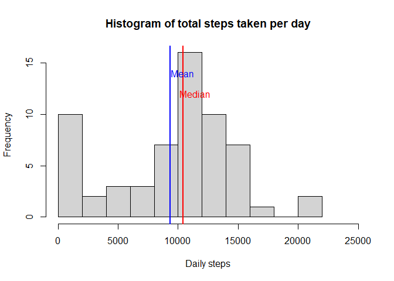
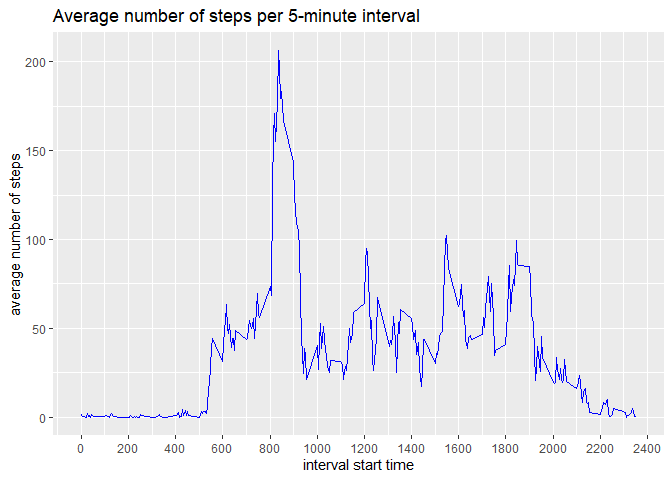
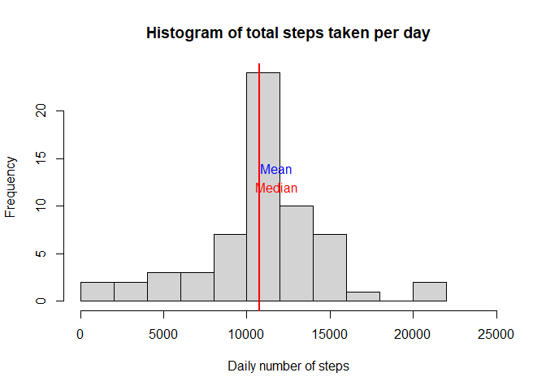
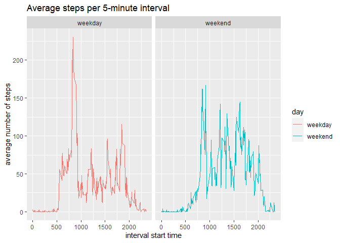

## Loading and preprocessing the data

Upload relevant libraries, load the data and convert dates to date format.  


```r
library(dplyr)
```

```
## 
## Attaching package: 'dplyr'
```

```
## The following objects are masked from 'package:stats':
## 
##     filter, lag
```

```
## The following objects are masked from 'package:base':
## 
##     intersect, setdiff, setequal, union
```

```r
library(ggplot2)
library(tidyr)
unzip("./activity.zip")
data <- read.csv("activity.csv")
data$date <- as.Date(data$date)
```

## What is mean total number of steps taken per day?

Group the data by date and sum the number of steps for each day.  
Create histogram and calculate mean and median.  


```r
total_per_day <- group_by(data,date) %>% summarize(steps=sum(steps,na.rm=TRUE))
hist(total_per_day$steps,xlab="Daily steps",ylab="Frequency",main="Histogram of total steps taken per day",breaks=12,xlim=range(0,25000))
abline(v=mean(total_per_day$steps),col="blue",lwd=2)
abline(v=median(total_per_day$steps),col="red",lwd=2)
text(x=mean(total_per_day$steps)+1000,y=14,"Mean",col="blue")
text(x=median(total_per_day$steps)+1000,y=12,"Median",col="red")
```

<!-- -->

```r
dailymean <- format(mean(total_per_day$steps),scipen=10,digits=2)
dailymedian <- format(median(total_per_day$steps),scipen=10,digits=2)
```
The average daily number of steps is 9354, and the median daily number of steps is 10395.

## What is the average daily activity pattern?

Group the data by interval and calculate the average number of steps across the 61 days for each interval.  
Create line chart showing the average number of steps per interval.  


```r
avg_per_interval <-group_by(data,interval)%>%summarize(steps=mean(steps,na.rm=TRUE))
g<-ggplot(avg_per_interval,aes(interval,steps))
g+geom_line(color="blue")+
  labs(title="Average number of steps per 5-minute interval",y="average number of steps")+
  scale_x_continuous(name="interval start time",breaks=seq(0,2400,200))
```

<!-- -->

Determine the maximum and at which time it occurs. 

```r
filter(avg_per_interval,avg_per_interval$steps==max(avg_per_interval$steps))
```

```
## # A tibble: 1 × 2
##   interval steps
##      <int> <dbl>
## 1      835  206.
```
The maximum number of steps occur in the 08:35am interval, when c. 206 steps are taken on average.


## Imputing missing values


```r
Missing_total <- sum(is.na(data$steps))
Missing_percent <- format(mean(is.na(data$steps))*100,digits=4)
```

There are 2304 missing values, or c.13.11% of total observations. Often observations are missing for entire days.  

I have opted to impute missing values from the average number of steps per interval.  
Then, as above, group the data by date and sum the number of steps for each day.    
Create histogram and calculate mean and median.


```r
days <- max(data$date)-min(data$date)+1
data$averages <- rep(avg_per_interval$steps,days)
data1<-data
data1$steps <- coalesce(data1$steps,data1$averages)
total_per_day1 <- group_by(data1,date) %>% summarize(steps=sum(steps,na.rm=TRUE))
hist(total_per_day1$steps,xlab="Daily number of steps",ylab="Frequency",main="Histogram of total steps taken per day",breaks=12,xlim=range(0,25000))
abline(v=mean(total_per_day1$steps),col="blue",lwd=2)
abline(v=median(total_per_day1$steps),col="red",lwd=2)
text(x=mean(total_per_day1$steps)+1000,y=14,"Mean",col="blue")
text(x=median(total_per_day1$steps)+1000,y=12,"Median",col="red")
```

<!-- -->

```r
dailymean1 <- format(mean(total_per_day1$steps),scipen=10,digits=2)
dailymedian1 <- format(median(total_per_day1$steps),scipen=10,digits=2)
```
The imputation increases the average and median daily steps to 10766 and 10766, respectively, and makes the histogram more symmetrical (because previously, several days had shown as zero steps due to missing values).  


## Are there differences in activity patterns between weekdays and weekends?

Create factor variable "day".  
Group by day and interval and calculate the average number of steps by subgroup.  
Create faceted plot for weekdays and weekends.


```r
data1$day <- weekdays(data1$date)
data1$day <- gsub("Monday","weekday",data1$day)
data1$day <- gsub("Tuesday","weekday",data1$day)
data1$day <- gsub("Wednesday","weekday",data1$day)
data1$day <- gsub("Thursday","weekday",data1$day)
data1$day <- gsub("Friday","weekday",data1$day)
data1$day <- gsub("Saturday","weekend",data1$day)
data1$day <- gsub("Sunday","weekend",data1$day)
data1$day <- as.factor(data1$day)
grouped <- data1 %>% group_by(day,interval) %>% summarize(steps=mean(steps))
```

```
## `summarise()` has grouped output by 'day'. You can override using the `.groups`
## argument.
```

```r
dF <- data.frame(day=as.factor(grouped$day),interval=grouped$interval,steps=grouped$steps)
qplot(interval,steps,data=dF,geom="line", color=day,facets=.~day,main="Average steps per 5-minute interval",xlab="interval start time",ylab="average number of steps")
```

```
## Warning: `qplot()` was deprecated in ggplot2 3.4.0.
```

<!-- -->

The average daily number of steps increases slightly on weekends compared to weekdays. The 08.35am peak appears to be limited to weekdays, possibly because this is when most people go to / arrive at the work.
